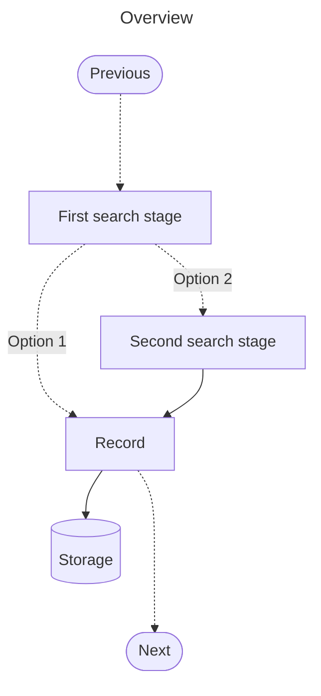
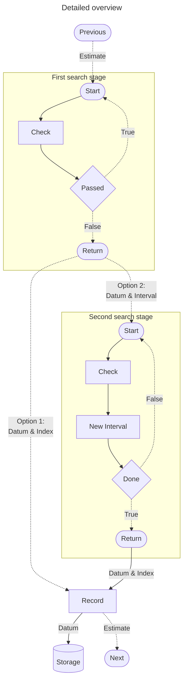
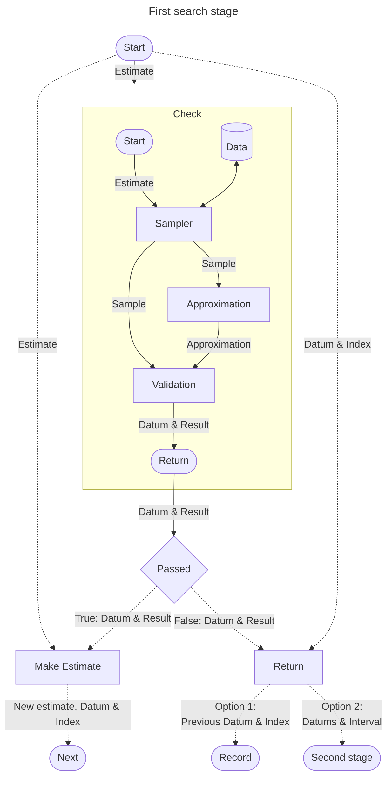
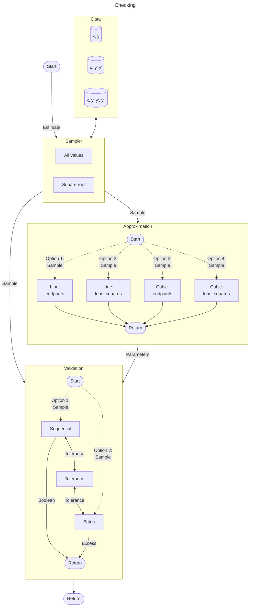
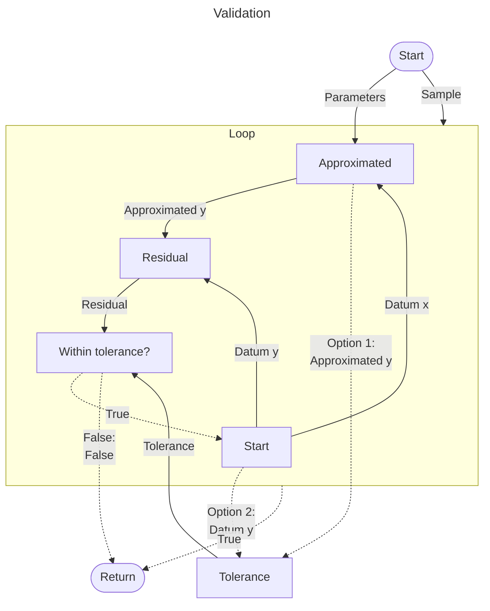
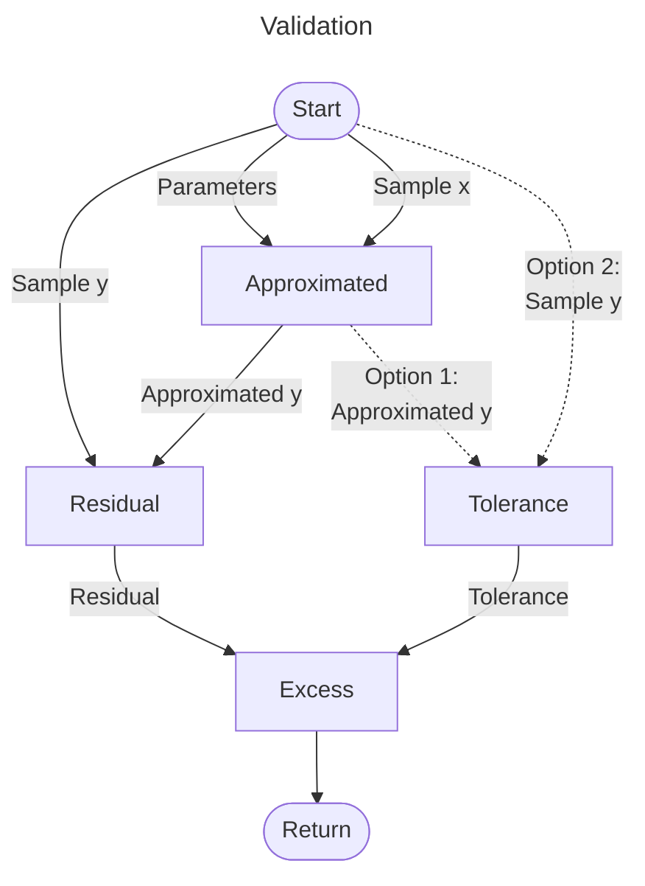
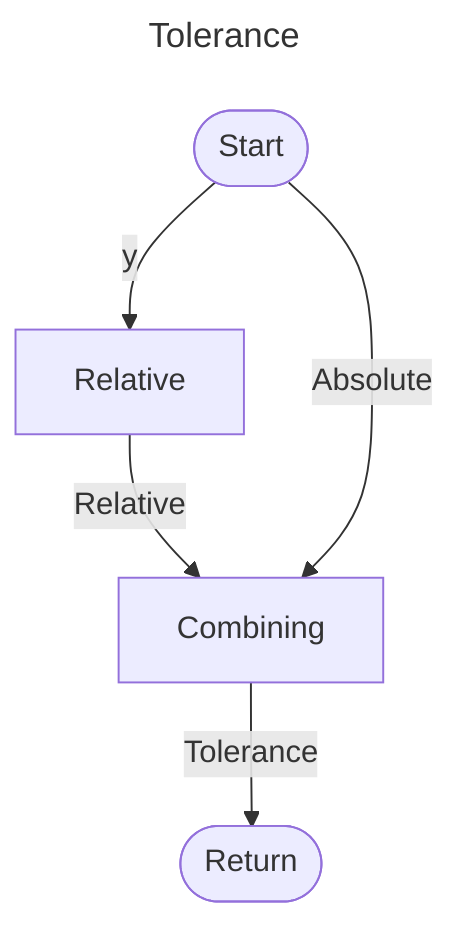

# Algorithm

## TOC <!-- omit in toc -->

- [Algorithm](#algorithm)

## Overview

Generals tructure is

Finding where to compress
1. Pick a spot in data
2. Calculate approximation function for that spot
3. Verify by comparing the approximations to real ones
    - If within tolerance, save the data
    - Else got to step 1

Steps for making as single complete comporession step

### Expanded version

## First search stage

Each first search stage iteration

## Second search stage

## Record

## Checking

### Sampler

### Approximation

### Validation

#### Sequential

#### Batch

#### Tolerance

