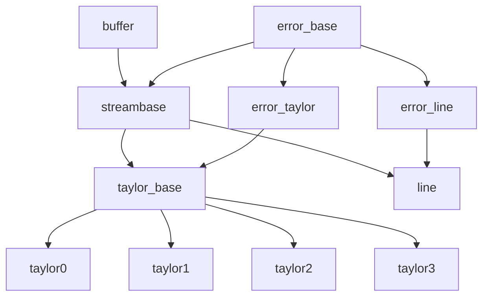

## Class strucute

```mermaid
flowchart TB;

buffer --> streambase
error_base --> streambase

error_base --> error_taylor
error_base --> error_line

streambase --> taylor_base
error_taylor --> taylor_base

taylor_base --> taylor0
taylor_base --> taylor1
taylor_base --> taylor2
taylor_base --> taylor3

streambase --> line
error_line --> line

```
